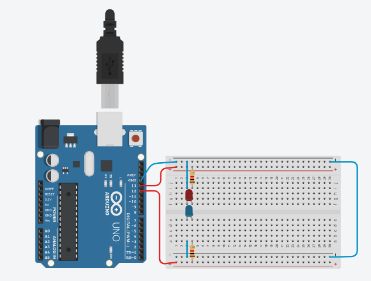

# Projeto Arduíno para piscar o led incorporado v1.

## Contextualização

-Neste experimento faz com que o LED incorporado e os LED pisque paralelamente utilizando o pino 13 (LED_BUILTIN) e o pino 12. 

## Esquema do projeto

